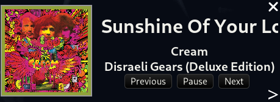

# now-playing
## Built with Druid-rs and MPRIS
On top of the desktop  
Can pause/play, go back/next  
Can interface with players that use MPRIS  

# Images

## To-Do
1. Make it click through
1. Add audio visualizer in the widget
